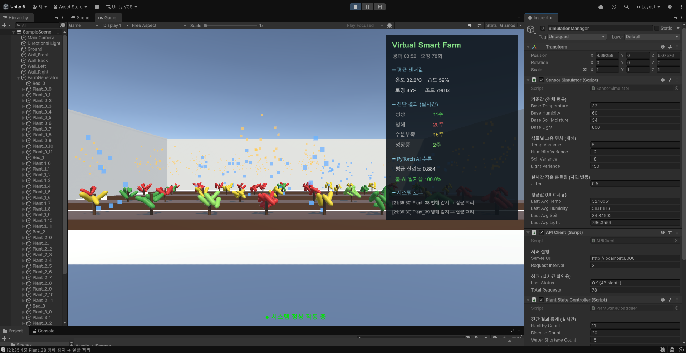
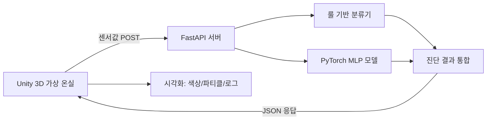

# 🌱 Virtual Smart Farm

> AI 기반 가상 온실 시뮬레이션 시스템  
> **군산대학교 임베디드소프트웨어학과 캡스톤 디자인 (1학기)**



---

## 📌 프로젝트 개요

Unity 3D 가상 온실 환경에서 멀티 센서 데이터를 실시간 시뮬레이션하고, PyTorch 기반 분류 모델이 식물의 상태를 자동 진단하여 시각적으로 대응하는 스마트팜 시뮬레이션 시스템이다.

기존 라즈베리파이 + 실제 센서 기반 하드웨어 구성에서, **Unity 3D 가상환경**으로 전환하여 다음과 같은 이점을 확보:

- **재현성**: 동일 조건 반복 실험 가능
- **시나리오 다양성**: 가뭄, 병해 등 극단 환경 시뮬레이션
- **확장성**: 식물 수, 베드 구조 자유 조정
- **안전성**: 하드웨어 손상 위험 없음

---

## 🎯 주요 기능

- **실시간 센서 시뮬레이션** — 48개 식물에 대해 온도/습도/토양수분/조도 4채널 데이터 생성
- **멀티모달 분류기** — 룰 기반 + PyTorch MLP 학습 모델 병행 추론
- **자동 대응 시각화** — 수분부족 시 급수 파티클, 병해 시 살균 효과
- **실시간 대시보드** — 평균 센서값, 클래스별 카운트, AI 신뢰도, 시스템 로그
- **상태 전이 추적** — 식물별 상태 변화 감지 및 이벤트 로깅

---

## 🏗️ 시스템 아키텍처



데이터 흐름:
1. Unity가 1초 주기로 48개 식물 센서값을 일괄 생성
2. FastAPI 서버가 룰 기반 + PyTorch 추론을 동시 수행
3. 두 결과를 비교하여 일치율 계산 후 응답
4. Unity가 응답을 받아 식물 색상·파티클·대시보드를 실시간 갱신

---

## 🛠️ 기술 스택

| 분류 | 도구 |
|------|------|
| 시뮬레이션 | Unity 6 LTS (6000.4.4f1), C# |
| AI 모델 | PyTorch, MLP (4→64→64→4) |
| 서버 | FastAPI, Uvicorn, Pydantic |
| 통신 | REST API (JSON) |
| 개발환경 | Windows 11, VSCode |

---

## 🌿 분류 클래스

| 클래스 | 색상 | 트리거 조건 (룰) |
|--------|------|----------------|
| 정상 (healthy) | 🟢 초록 | 기본 상태 |
| 병해 (disease) | 🔴 빨강 | 온도 > 32°C 또는 습도 > 90% |
| 수분부족 (water_shortage) | 🟡 노랑 | 토양수분 < 30% |
| 성장중 (growth_stage) | 🟩 연두 | 조도 > 700 lx AND 20°C < 온도 < 28°C |

---

## 📂 폴더 구조

```
virtual-smartfarm/
├── unity/                          # Unity 3D 프로젝트
│   └── VirtualSmartFarm/
│       └── Assets/Scripts/
│           ├── GreenhouseGenerator.cs    # 농장 자동 생성
│           ├── SensorSimulator.cs        # 센서값 시뮬레이션
│           ├── APIClient.cs              # 서버 통신
│           ├── PlantStateController.cs   # 식물 상태 시각화
│           ├── PlantResponse.cs          # 파티클 효과
│           ├── DashboardUI.cs            # 실시간 대시보드
│           └── EventLogger.cs            # 시스템 로그
├── ai_model/
│   └── plant_ai.py                 # PyTorch 분류기 + 학습/추론
├── server/
│   └── api_server.py               # FastAPI 서버
├── docs/                           # 문서, 스크린샷, 영상
└── README.md
```

---

## 🚀 설치 및 실행

### 1. Python 환경 (서버)

```bash
cd virtual-smartfarm
pip install -r ai_model/requirements.txt
python server/api_server.py
```

첫 실행 시 PyTorch 모델 학습이 자동으로 진행됨 (약 1분).  
이후 실행에서는 저장된 모델(`ai_model/sensor_classifier.pt`)을 자동 로드.

### 2. Unity 프로젝트

1. Unity Hub에서 `unity/VirtualSmartFarm/` 폴더 열기 (Unity 6 LTS 필요)
2. `SampleScene` 로드
3. **▶ Play** 버튼

서버가 켜져 있어야 정상 작동. 미연결 시 대시보드 하단에 "통신 오류" 표시.

---

## 🧠 PyTorch 모델

### 구조

```python
SensorClassifier(
    Linear(4, 64) → ReLU → Dropout(0.2)
    → Linear(64, 64) → ReLU
    → Linear(64, 4)
)
```

- **입력**: 정규화된 센서값 4개 (온도/습도/토양/조도)
- **출력**: 4클래스 logits
- **학습 데이터**: 합성 데이터 8,000건 (룰 기반 라벨 + 5% 라벨 노이즈)
- **학습 정확도**: 약 97~98%
- **에폭**: 50, 옵티마이저: Adam (lr=1e-3)

### 추론

```python
from plant_ai import PlantAI
ai = PlantAI()
plant_class, confidence = ai.predict(temp, humidity, soil, light)
```

---

## 📅 1학기 진행 현황

- [x] 시스템 아키텍처 설계
- [x] Unity 가상 온실 환경 구축 (48개 식물, 4개 베드)
- [x] FastAPI 통신 서버 구현
- [x] 룰 기반 분류기 구현
- [x] PyTorch MLP 분류 모델 학습 및 추론 통합
- [x] 실시간 대시보드 UI 구현
- [x] 자동 대응 시각화 (파티클 효과)
- [x] 식물 모델 업그레이드 (줄기 + 잎사귀 구조)
- [x] 데모 시연 영상 제작

---

## 🔮 향후 계획 (2학기)

- 이미지 기반 멀티모달 모델 통합 (EfficientNet-B0 + MLP 융합)
- 실제 식물 데이터셋 (PlantVillage) 학습 적용
- 시간 가속 시뮬레이션 (Day/Night cycle)
- 데이터 로깅 및 히스토리 시각화
- 다중 작물 종류 지원

---

## 👤 개발자

**채우진** (2101087)  
군산대학교 임베디드소프트웨어학과

---

## 📄 라이선스

이 프로젝트는 학술 목적의 캡스톤 디자인 작품이다.
