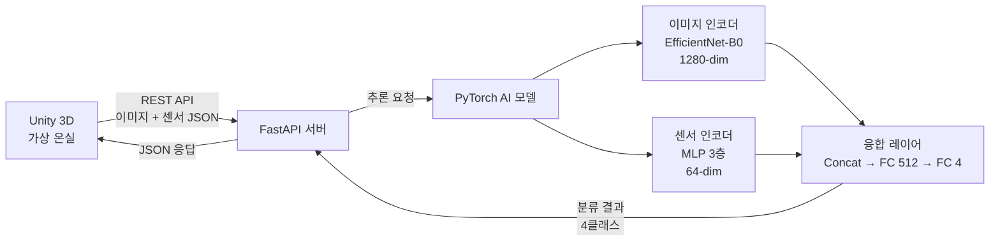

# 🌱 Virtual Smart Farm — AI 기반 가상 온실 시뮬레이션

> **군산대학교 임베디드소프트웨어학과 캡스톤 디자인 (1학기)**

---

## 프로젝트 개요

멀티모달 AI(이미지 + 센서 데이터)를 활용하여 식물의 상태를 자동 진단하고,  
Unity 3D 가상 온실 환경에서 다양한 시나리오를 시뮬레이션하는 시스템입니다.

- **이미지 인코더** (EfficientNet-B0): 식물 외형 이미지 분석
- **센서 인코더** (MLP): 온도, 습도, 토양수분, 조도 데이터 처리
- **융합 모델**: 두 모달리티를 결합하여 식물 상태 4클래스 분류
- **Unity 3D**: 가상 온실 환경 렌더링 및 시뮬레이션 제어
- **FastAPI 서버**: Unity ↔ AI 모델 간 통신 중계

---

## 1학기 범위

> 소프트웨어 시뮬레이션 + AI 모델 구현에 집중 (실제 하드웨어 없음, Unity 가상환경으로 대체)

### 변경 사유

| 기존 계획 | 변경된 계획 |
|-----------|------------|
| 라즈베리파이 + 실제 센서 구성 | Unity 3D 가상 시뮬레이션으로 대체 |

**변경 이유:**
- 재현성: 동일한 실험 조건을 언제든 재현 가능
- 다양한 시나리오 테스트: 병해, 수분 부족 등 극단적 조건도 안전하게 실험
- 하드웨어 의존성 제거: 개발 및 테스트 환경의 안정성 확보
- 빠른 프로토타이핑: 하드웨어 조달 없이 즉시 개발 가능

---

## 시스템 아키텍처



---

## 분류 클래스

| 클래스 ID | 클래스명 | 설명 |
|-----------|---------|------|
| 0 | 정상 (Healthy) | 식물이 건강한 상태 |
| 1 | 병해 (Disease) | 병원균 감염 또는 병충해 |
| 2 | 수분부족 (Drought) | 토양 수분 부족 상태 |
| 3 | 성장단계 (Growth Stage) | 특정 성장 단계 식별 |

---

## 기술 스택

| 분류 | 도구 |
|------|------|
| 시뮬레이션 | Unity 6 LTS, C# |
| AI 모델 | PyTorch, EfficientNet-B0 |
| 서버 | FastAPI, Uvicorn |
| 통신 | REST API (JSON) |
| 개발환경 | VSCode, Windows 11 |

---

## 1학기 마일스톤

| 주차 | 내용 | 산출물 |
|------|------|--------|
| 4월 | 환경 구축, 가상 온실 모델링, AI 모델 골격 | 프로젝트 초기 세팅, Unity 씬, 모델 코드 |
| 5월 | 데이터셋 준비, 모델 학습, Unity-AI 통신 구현 | 학습된 모델(.pt), API 연동 테스트 |
| 6월 | 통합 테스트, UI 개선 | 통합 테스트 보고서, 개선된 UI |
| 기말 | 데모 시연 영상, 최종 보고서 | 시연 영상, 최종 보고서 PDF |

---

## 폴더 구조

```
virtual-smartfarm/
├── unity/                    # Unity 3D 프로젝트 (가상 온실 시뮬레이션)
│   └── .gitkeep
├── ai_model/                 # PyTorch AI 모델
│   ├── models/
│   │   ├── __init__.py
│   │   ├── image_encoder.py  # EfficientNet-B0 이미지 인코더
│   │   ├── sensor_encoder.py # MLP 센서 인코더
│   │   └── fusion_model.py   # 멀티모달 융합 모델
│   ├── train.py              # 학습 스크립트
│   ├── inference.py          # 추론 스크립트
│   └── requirements.txt      # Python 의존성
├── server/
│   └── api_server.py         # FastAPI 서버
├── docs/
│   ├── architecture.md       # 시스템 아키텍처 상세
│   └── milestones.md         # 주차별 마일스톤
├── .gitignore
└── README.md
```

---

## 실행 방법

### AI 서버 실행

```bash
# 의존성 설치
cd ai_model
pip install -r requirements.txt

# 서버 실행
cd ../server
uvicorn api_server:app --host 0.0.0.0 --port 8000 --reload
```

> **TODO:** 모델 학습 완료 후 실행 방법 업데이트 예정

### Unity 클라이언트

> **TODO:** Unity 프로젝트 빌드 및 실행 방법 추가 예정

---

## 개발자

| 이름 | 학번 | 소속 |
|------|------|------|
| 채우진 | 2101087 | 군산대학교 임베디드소프트웨어학과 |
