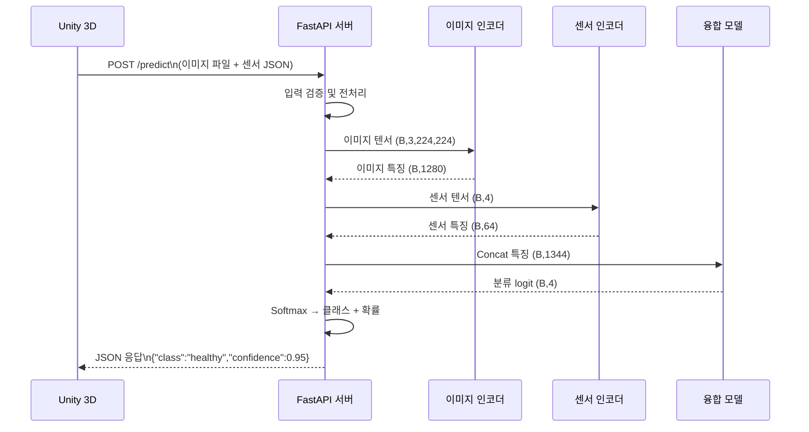

# 시스템 아키텍처

## 컴포넌트별 역할

| 컴포넌트 | 역할 | 기술 |
|----------|------|------|
| Unity 3D 가상 온실 | 가상 식물 환경 렌더링, 센서값 시뮬레이션, 사용자 인터페이스 | Unity 6 LTS, C# |
| FastAPI 서버 | Unity-AI 통신 중계, 요청 검증, 응답 포맷팅 | FastAPI, Uvicorn |
| 이미지 인코더 | 식물 이미지에서 시각적 특징 추출 | EfficientNet-B0, PyTorch |
| 센서 인코더 | 온도/습도/토양수분/조도 → 수치 특징 추출 | MLP 3층, PyTorch |
| 융합 모델 | 이미지+센서 특징 결합 → 4클래스 분류 | FC 레이어, PyTorch |

---

## 데이터 흐름도



---

## 전체 시스템 아키텍처

```mermaid
graph TB
    subgraph Unity["Unity 3D 가상 온실"]
        V[가상 식물 씬]
        SC[센서 시뮬레이터\n온도/습도/토양수분/조도]
        CAM[가상 카메라\n이미지 캡처]
        UI[진단 결과 UI\n상태 표시 패널]
    end

    subgraph Server["FastAPI 서버 (:8000)"]
        HC[GET /health]
        PR[POST /predict]
        MW[CORS 미들웨어]
    end

    subgraph AI["PyTorch AI 모델"]
        IE[이미지 인코더\nEfficientNet-B0\n→ 1280-dim]
        SE[센서 인코더\nMLP 3층\n→ 64-dim]
        FM[융합 모델\nConcat 1344\n→ FC 512 → FC 4]
    end

    CAM -->|PNG/JPG| PR
    SC -->|JSON| PR
    PR --> IE
    PR --> SE
    IE --> FM
    SE --> FM
    FM -->|4클래스 확률| PR
    PR -->|{"class","confidence"}| UI
```

---

## API 엔드포인트 명세

### GET /health

상태 확인용 헬스체크 엔드포인트

**응답**
```json
{"status": "ok"}
```

---

### POST /predict

식물 상태 분류 추론 엔드포인트

**요청 (multipart/form-data)**

| 필드 | 타입 | 설명 |
|------|------|------|
| `image` | File | 식물 이미지 (jpg/png, 권장 해상도: 224×224 이상) |
| `sensor_data` | String (JSON) | 센서 데이터 JSON 문자열 |

**sensor_data 형식**
```json
{
  "temperature": 25.0,
  "humidity": 60.0,
  "soil_moisture": 45.0,
  "illuminance": 3000.0
}
```

| 필드 | 단위 | 범위 |
|------|------|------|
| temperature | °C | 0 ~ 50 |
| humidity | % | 0 ~ 100 |
| soil_moisture | % | 0 ~ 100 |
| illuminance | lux | 0 ~ 100000 |

**응답**
```json
{
  "class": "healthy",
  "class_id": 0,
  "confidence": 0.95,
  "probabilities": {
    "healthy": 0.95,
    "disease": 0.02,
    "drought": 0.02,
    "growth_stage": 0.01
  },
  "sensor_data": {
    "temperature": 25.0,
    "humidity": 60.0,
    "soil_moisture": 45.0,
    "illuminance": 3000.0
  }
}
```

**분류 클래스**

| class_id | class | 의미 |
|----------|-------|------|
| 0 | healthy | 정상 |
| 1 | disease | 병해 |
| 2 | drought | 수분부족 |
| 3 | growth_stage | 성장단계 |

---

## AI 모델 상세

### 이미지 인코더 (ImageEncoder)

- **베이스 모델**: EfficientNet-B0 (ImageNet 사전학습)
- **출력**: 1280-dim feature vector
- **입력 크기**: (B, 3, 224, 224)
- **전처리**: Resize → ToTensor → Normalize(ImageNet stats)

### 센서 인코더 (SensorEncoder)

```
Linear(4 → 128) → BatchNorm → ReLU
Linear(128 → 128) → BatchNorm → ReLU
Linear(128 → 64) → ReLU
```

### 융합 모델 (FusionModel)

```
Concat([이미지 1280, 센서 64]) = 1344-dim
→ Linear(1344 → 512) → ReLU → Dropout(0.3)
→ Linear(512 → 4)
→ (학습: CrossEntropyLoss | 추론: Softmax)
```
